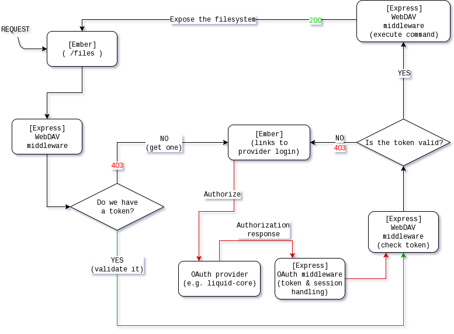

# Authentication in Davros

## OAuth 2.0

Supported providers:

* [Django OAuth Toolkit](https://github.com/evonove/django-oauth-toolkit)`

For a list of environment variables needed for OAuth to work, please consult the OAuth section in the [README](../README.md) file.

The purpose of this document is to provide an overview of the authentication / authorization flow.

## The request life cycle

For any request on non-DAV related routes, access is not restricted in any way. However, if the web client tries to access the WebDAV endpoints of the backend, it will **have** to be authenticated against a OAuth provider.

On first access:

* The frontend (Ember app) requests a file listing
* A new and empty session is started and persisted on the backend
* Backend responds with a `403` status and sends back a header containing the OAuth endpoint for requesting authorization
  * The header is used by the frontend to generate a link where the user can log in
  * This takes the user to the provider's authentication/authorization dialog
* Following authorization, a token is obtained by the backend and stored within the session created earlier
* The WebDAV middleware receives and validates the token
  * If all is correct, it should return the file listing as requested by the frontend
  
On subsequent visits / page refresh etc.:

* The frontend (Ember app) requests a file listing / upload / delete
* The corresponding session is loaded from the persistent storage
  * If a token is present, validate the token against the OAuth provider
* If the token is valid (returns a corresponding user profile), proceed with the reqeusted DAV command
* If the token is not valid for whatever reason, return `403` together with the OAuth endpoint in a header

A graphical representation:

